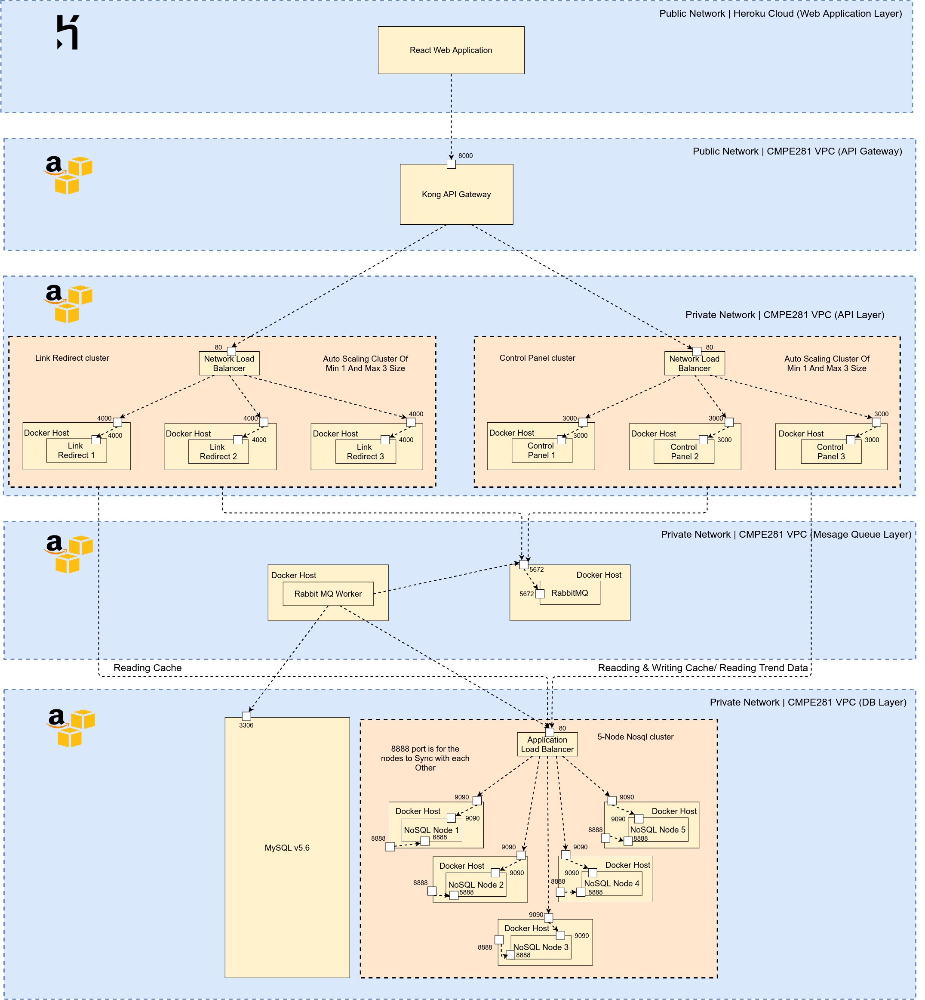
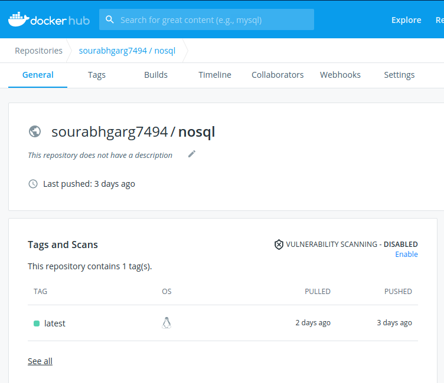
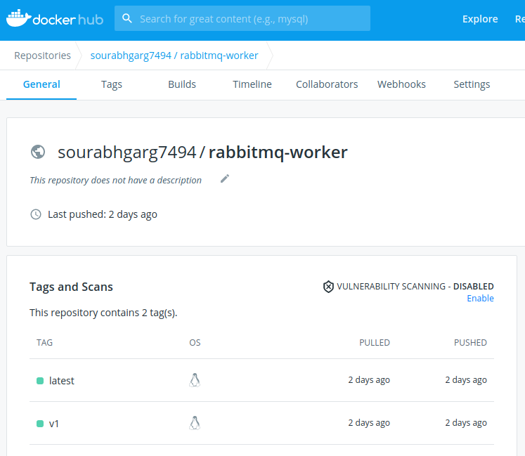
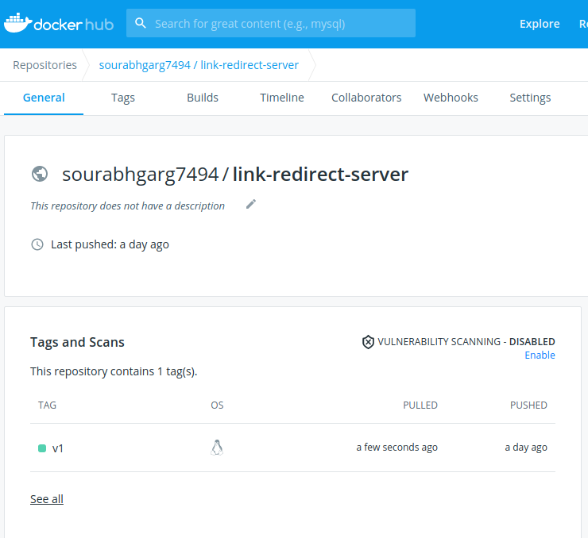
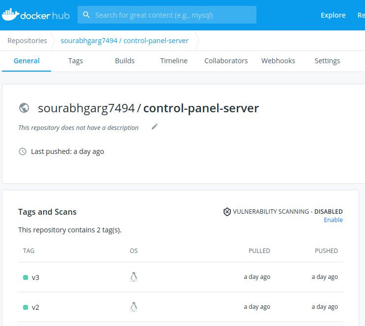
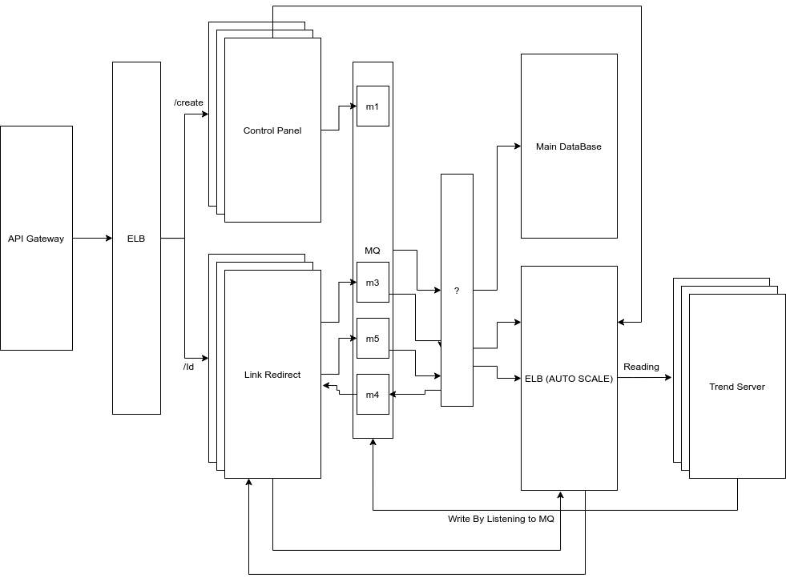

# Cloud Project

## BitLy Clone

### Architecture Diagram of the application

 * Below architecture diagram of the application is created using Draw.io.

 

### Extra Credit Option Chosen - Heroku based web application.

* For the extra credit option created the React.JS based web application.
 
* Created home page to take the Expanded URL and show the shortened URL.

 * Created the Trend page with the to show trend of the last 10 days and number of links generated per day. Created a graph for it for visual representation of the data.

 * On the trend page, also displayed the data of all the links created. With details of each link. Like Expanded URL, Short URL, And number of clicks on each URL.

### Progress From 06 December - 09 December

 * Started the deployment with the MySQL DB. Created a EC2 VM instance on AWS.

 * Then created the image of the NoSql app and pushed to docker hub, to pull into five docker host EC2 instances as shown in the below image.

 

 * Pulled this image on all five instances and registered them for each other by curl commands.

 * After all the hosts were ready, connected them to an internal application load balancer.

 * After setting up the nosql cluster, deployed the rabbit mq from the docker hub official image.

 * Then pushed **rabbitmq-worker** to docker hub to pull into EC2 instance as shown in the image below.



 * Launched a docker host for deploying this worker.

 * After that created the docker image for the Link redirect server API and Control Panel server API. And pushed it to docker hub as shown in the image below.

 **Link Redirect ServerAPI**
 

 **Control Panel ServerAPI**
 

 * Pulled and ran (with auto restart) these images into two public docker host ec2 instance and created AMI for both of them.

 * Used these AMIs to setup Launch configuration and autoscale groups. Created target groups also to attach with autoscale groups.

 * After that created 2 **internal Network load balancer** and attached it with target groups for both Link Redirect server and Control Panel Server.

 * After the targets in the target group were healthy, tested both API's from the jumpbox with the internal load balancers.

 * Using the previously created Kong AMI launched a Public EC2 instance to configure Kong API gateway for both the services. This is a DB less Mode configuration of kong api using declarative statements. Below is the content of **Kong.yml** from the instance.

 ```
 _format_version: "1.1"

services:
- name: linkredirect
  protocol: http
  host: lr-nlb-ed1c61620e2770d4.elb.us-east-1.amazonaws.com
  port: 80
  path: /
  routes:
  - name: linkredirect
    paths:
    - /lr
- name: controlpanel
  protocol: http
  host: dwarfurl-nlb-1c189fbcd07f8d1e.elb.us-east-1.amazonaws.com
  port: 80
  path: /
  routes:
  - name: controlpanel
    paths:
    - /


plugins:
- name: file-log
  config:
    path: /tmp/file.log
    reopen: true
 ``` 

 * Created two services in the yml file for both Link redirect and Control panel server. Configured the API gateway to full proxy to API Network load balancer.

 * After configuring it tested api gateway using public IP.

 * After that Pushed the code for the frontend to the heroku git using heroku commandline interface and pushed the build.

 * After successful build on the heroku cloud, tried testing the Application but was not working as heroku was deployed on **https** and backend was on **http**. 

 * After doing some research online got to know that heroku provides both https and http version. So, moved to the **http** version of the application.

 * Tested it after moving to the http version of the app again tested it but still it was not working due the CORS issue. Forgot to change the frontendURL in the CORS in the backend APIs.

 * Changed the code for backend API's and again followed the above steps for Link redirect and Control panel server.

 * Tested it again and it was working this time. Tested all the APIs and saw if all the functionality is working or not.


### Progress From 29 November - 05 December

 * Completed the Front-end Application with all the components.

 * Created home page to take the Expanded URL and show the shortened URL.

 * Created the Trend page with the to show trend of the last 10 days and number of links generated per day. Created a graph for it for visual representation of the data.

 * On the trend page, also displayed the data of all the links created. With details of each link. Like Expanded URL, Short URL, And number of clicks on each URL.

 * Ran full application in the local machine and tested it from start to end and fixed bugs on backend as well as front-end.

 * Ran into CORS issue in local. Fixed it by using **rs/cors** github package.

 * Next week planning on deploying everything on the cloud and creating a demo video for the application.

### Progress From 22 November - 28 November

* Added the code in the Control Panel Server to Insert the data in the Cache server by directly calling the API for the NoSqlVclock project.

* Also added the code in the RabitMQ worker for intersting the data in the Trend server. Which is again the NoSqlVclock Project.

* NoSqlVclock server cluster is acting as both Trend server and Cache server. 

* When intersing and fetching the Cache server the API servers will directly connect to the NoSqlVclock cluster.

* For Trend Server data the API servers will post and update the data with the help of the RabitMQ.

* Completed the code for the Link Redirect server. 

* Created redirect API with **/{Id}** path. the **Id** will be the Unique Id generated from the Control Panel Server. The base path of the API will be the BASE url of the server. i.e. "https://dwarfurl.tk"

* After reading the data from the Cache server the link redirect server will be push a message to the RabitMQ queue to update the count of the trend data for the URL.

* And after pushing the message the server will redirect to the Longer URL.

* Currently the Mysql Data is also getting updated from for the Link clicks and updated_date.

* Next week, planning to work on the frontend and Autodiscovery of the node for NoSqlVclock autoscale.

* Currently thinking of using the RabitMQ queues with a below mechanism for the autodiscovery.
  1. A Node in the cluster will be a producer and also the consumer to the queue.
  2. If a message is published in the queue with its own node Id the node will ignore the message.
  3. Once a Node starts it will push a message to the Queue.
  4. Other nodes will read this message and will add new node to their list.
  5. And will send the Sync to the new node.

* Still thinking if the above mention method will work and also how to implement the 5 point of the mechanism.

* Looking into the option of using the zookeeper also for the node management.

### Progress From 15 November - 21 November

* Completed the Control Panel API with Rabit MQ and setup and MySql Data.

* Created API for Creating the short link. This API will generate a random alphanumeric string of 7 characters. This string will act at a **Unique Id** for the short URL. The short URL will be Base URL + UniqueID. For instance: "https://dwarfurl.tk/" + "DT7tXhG" = "https://dwarfurl.tk/DT7tXhG"

* This **UniqueID** will act as a parameter to the link redirect server while hitting the url.

* In the data base a table is created with the name **urls** with the below schema:
```
CREATE TABLE urls (
  id bigint(20) NOT NULL AUTO_INCREMENT PRIMARY KEY,
  original_url varchar(8000) NOT NULL,
  uniqueId varchar(7) NOT NULL,
  clicks bigint(20) NULL,
  created_date datetime DEFAULT CURRENT_TIMESTAMP,
  updated_date datetime DEFAULT CURRENT_TIMESTAMP ON UPDATE CURRENT_TIMESTAMP,
  UNIQUE KEY uniqueId (uniqueId)
);
```

* The create api will push the data into **CreateLinkQueue** to be read by the RabitMQ Worker and insert data into Mysql Database.

* Plan for the next week is to Complete the Control Panel server and the Link redirect sever with Insertion in the Trend Server and also the Cache.

### Progress From 08 November - 14 November

* Read about the Rabbit MQ and tried with a basic Go consumer and provider.

* Started working on control panel GO API.

* Created a basic structure of the GO API for control panel.

* Checked how the external packages are incorporated in the existing code for GO API.

* Next week will try to compelete the GO APIs for both Link-Redirect Server and also the Control-Panel Server.

### Progress From 01 November - 07 November
  * Decided what Technologies gonna be using for the different type of servers.

  * Below is the currently finalized technology stack :       
    1. **Frontend**: React.JS
    2. **Control Panel**: GO API
    3. **Redirect Server**: GO API
    4. **Message Queue Worker**: GO
    5. **Message Queue**: RabitMQ
    6. **Trend Server**: JAVA noSQLvclock project.
    7. **Data Base**: AWS INSTANCE.

* Created a basic react app for the front end of the system.

* Created a rough architecture diagram of the whole system to understand the exact requirement as below.


